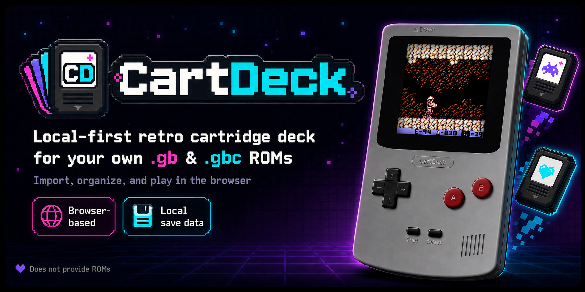

<p align="center">
  
</p>

<p align="center">
  A local-first retro cartridge deck for importing, organizing, and playing your own <code>.gb</code> and <code>.gbc</code> ROMs right in the browser.
</p>

## What CartDeck Is

CartDeck is a browser-based cartridge library and emulator interface built for people who want a clean, nostalgic way to manage their own legally owned Game Boy and Game Boy Color ROM files locally.

Everything important stays in your browser:

- ROM files
- cartridge metadata
- custom cover art
- save data
- custom backgrounds

CartDeck does **not** provide ROMs, BIOS files, firmware, or download links.

## Highlights

- Import `.gb` and `.gbc` ROMs from your device
- Store cartridges locally with IndexedDB via Dexie
- Edit cartridge titles and add custom cover artwork
- Launch the latest played cartridge in the emulator view
- Play with on-screen controls or keyboard controls
- Save and load emulator state when supported by the active WasmBoy API
- Customize theme, background, and motion settings
- Keep using the app even if the remote updates feed is unavailable

## How To Play

1. Install dependencies and start the dev server.
2. Open CartDeck in your browser.
3. Go to the library and choose **Add Cartridge**.
4. Confirm that you have the legal right to use the ROM.
5. Select a local `.gb` or `.gbc` file from your device.
6. Optionally rename the cartridge and add custom cover art.
7. Save the cartridge to your local library.
8. Open the cartridge to enter the emulator screen.
9. Use the keyboard or on-screen controls to play.
10. Use the emulator toolbar to play, pause, reset, mute, save state, or load state.

## Keyboard Controls

CartDeck binds keyboard input directly to the emulator joypad.

| Action | Key                           |
| ------ | ----------------------------- |
| Up     | `ArrowUp`                     |
| Right  | `ArrowRight`                  |
| Down   | `ArrowDown`                   |
| Left   | `ArrowLeft`                   |
| A      | `Z`                           |
| B      | `X`                           |
| Start  | `Enter`                       |
| Select | `Left Shift` or `Right Shift` |

## On-Screen Controls

The emulator UI also includes:

- a clickable/touch D-pad
- `A` and `B` action buttons
- `Start` and `Select` buttons
- toolbar actions for back, play/pause, reset, mute, save state, and load state

This makes CartDeck usable on both desktop and pointer-driven devices.

## Local Development

### Requirements

- Node.js `^20.19.0 || >=22.12.0`
- npm

### Install

```sh
npm install
```

### Start

```sh
npm run dev
```

CartDeck runs on:

```txt
http://0.0.0.0:5173
```

## Quality Checks

```sh
npm run lint
npm run build
```

## Tech Stack

- Vue 3
- Vite
- Vue Router
- Dexie / IndexedDB
- WasmBoy
- Tailwind CSS
- Custom retro console styling in `src/assets/styles/console.css`

## Project Flow

### Library

- Import cartridges locally
- Browse saved ROMs
- Launch a cartridge into the emulator
- Edit metadata and artwork
- Delete cartridges from local storage
- See the latest remote project updates when available

### Emulator

- Automatically loads the latest selected cartridge
- Connects keyboard and pointer input to the joypad
- Attempts autoplay after ROM load
- Falls back gracefully if autoplay is blocked by the browser
- Supports reset, mute, and save-state actions

### Settings

- Theme: `System`, `Dark`, `Light`
- Backgrounds: `Default`, `Pixel Grid`, `Neon Dungeon`, `Green LCD`, `Dark Arcade`
- Motion: `Full`, `Reduced`
- Upload a custom wallpaper image
- Request persistent browser storage
- Clear ROMs or all local CartDeck data

## Architecture Overview

- `src/router/index.js`: app routes and redirects to `/library`
- `src/db/cartdeckDb.js`: Dexie schema for ROMs, settings, and saves
- `src/composables/useRomLibrary.js`: ROM CRUD, deduplication, and latest-ROM lookup
- `src/composables/useSettings.js`: persisted UI and latest-ROM settings
- `src/composables/useUpdates.js`: remote updates feed with timeout and fallback handling
- `src/composables/useEmulator.js`: WasmBoy adapter for init, ROM loading, playback, reset, mute, and save/load state
- `src/composables/useKeyboardControls.js`: keyboard-to-joypad mapping
- `src/components/GameConsole.vue`: on-screen retro handheld UI and pointer controls

## Important Notes

- CartDeck is local-first and does not upload ROMs, saves, artwork, or backgrounds to a backend.
- Remote fetching is limited to the optional updates feed at `https://cartdeck.stacknstress.com/news/updates.json`.
- WasmBoy is an older emulator package, so browser behavior can vary.
- Save/load state actions are shown only when the current emulator API supports them.
- If a ROM fails to load, the app keeps the interface usable and shows a friendly error.

## Legal

- Import only files and artwork you have the right to use.
- CartDeck does not distribute games.
- CartDeck intentionally avoids official platform branding and copyrighted ROM bundles.

<details>
<summary>Quick command reference</summary>

```sh
npm install
npm run dev
npm run lint
npm run build
```

</details>
